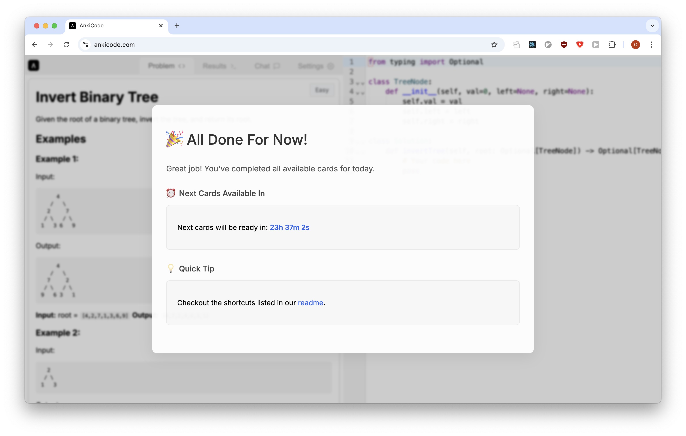

# AnkiCode  
AnkiCode is a web app that allows users to memorize basic LeetCode patterns using the spaced repetition package [ts-fsrs](https://github.com/open-spaced-repetition/ts-fsrs).  

  

For a solution to be marked as "good," it must pass the test suite on the first attempt without the help of the AI tutor. Once you've completed your reviews, you'll see the following message:  

  

Each day, a new problem will be introduced in a didactic order. Additionally, the spaced repetition algorithm will have you review problems whose solutions you are on the verge of forgetting.  

## Keyboard Shortcuts  

| Shortcut         | Action            |  
|-----------------|------------------|  
| Cmd + '        | Run Tests        |  
| Cmd + \\       | Next Problem     |  
| Cmd + H        | Enlarge Editor   |  
| Cmd + L        | Enlarge Menu     |  
| Cmd + Shift + O | Focus Chat      |  
| Cmd + Shift + P | Focus Problem   |  
| Cmd + Shift + I | Focus Editor    |  
| Cmd + J        | Scroll Menu Down |  
| Cmd + K        | Scroll Menu Up   |  
